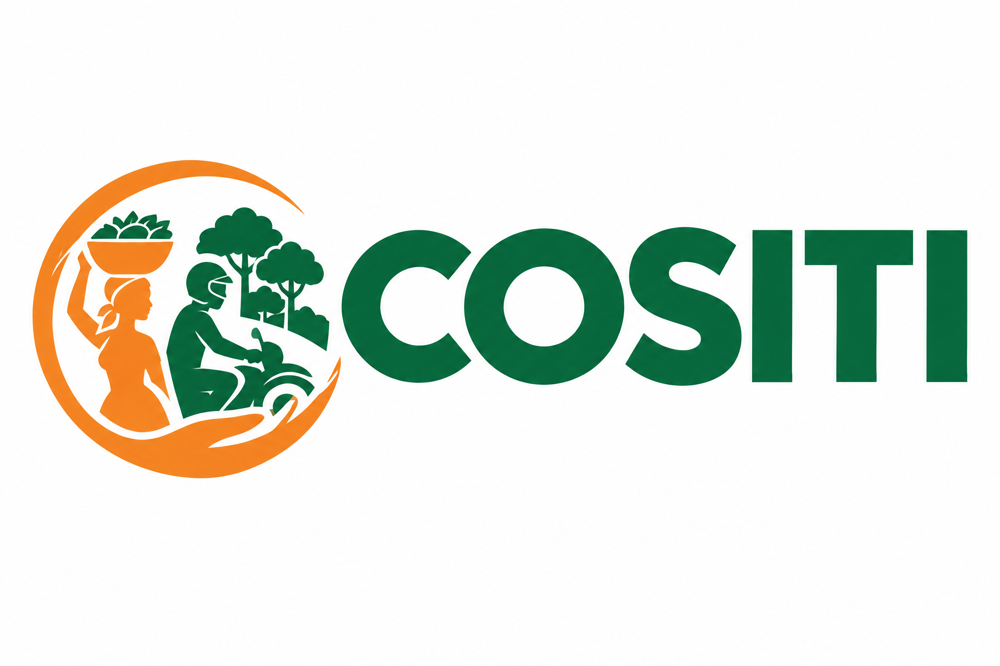
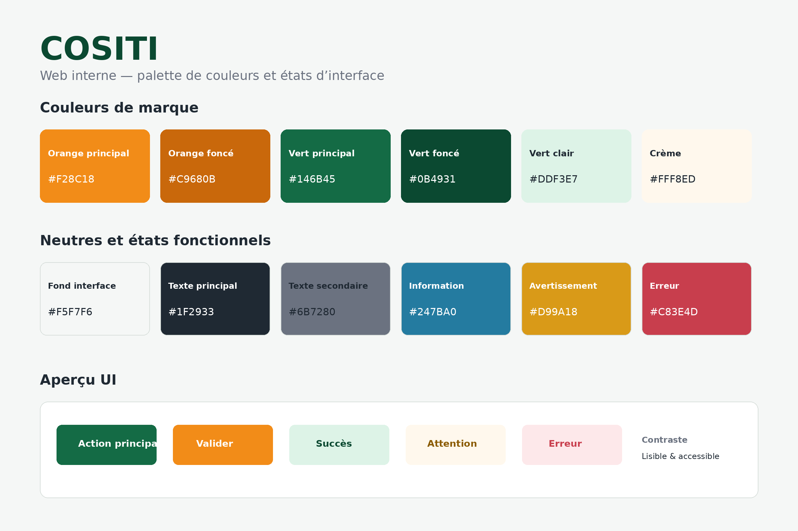
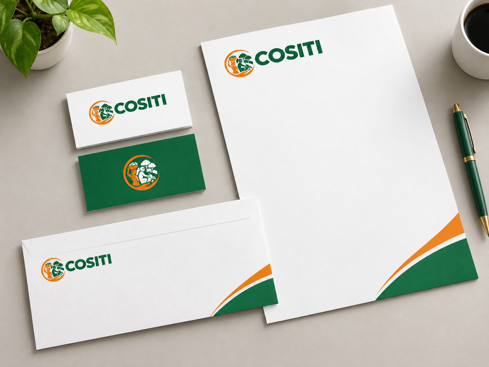
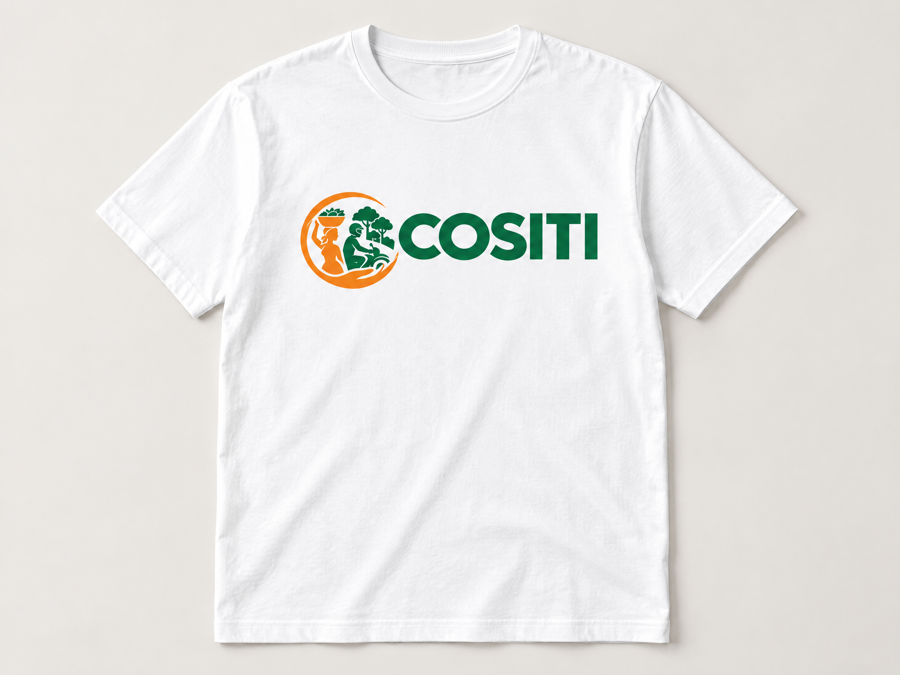

# COSITI — Charte graphique

## Guide de marque et système visuel pour la plateforme web interne

**Version de travail : septembre 2026**

---

## 1. Positionnement de la marque

COSITI exprime la coopération, l’entraide et l’action. Son univers graphique associe la chaleur de l’orange à la confiance du vert. Le symbole circulaire évoque le mouvement collectif, la protection et la continuité. Les silhouettes représentent les travailleurs et les activités économiques au cœur de la coopérative.

Pour la plateforme web interne, l’identité doit rester lisible, accessible et suffisamment neutre pour accueillir des données, des formulaires et des tableaux. L’orange attire l’attention sur l’action. Le vert structure la navigation et les éléments de confiance. Les fonds clairs réduisent la fatigue visuelle.

## 2. Palette de couleurs web

La palette suivante constitue la base recommandée pour les écrans, les composants UI et les supports numériques. Les codes HEX peuvent être repris directement dans CSS, Figma ou un système de design.

| Élément | Code HEX | Usage recommandé |
|---|---|---|
| Orange principal | `#F28C18` | Actions prioritaires et accents de marque |
| Orange foncé | `#C9680B` | Survol, confirmation et accents sombres |
| Vert principal | `#146B45` | Navigation, boutons principaux et actions positives |
| Vert foncé | `#0B4931` | Titres, navigation forte et fonds de contraste |
| Vert clair | `#DDF3E7` | Succès, badges et surfaces douces |
| Crème | `#FFF8ED` | Alertes douces et surfaces chaleureuses |
| Fond interface | `#F5F7F6` | Arrière-plan global de l’application |
| Texte principal | `#1F2933` | Contenu courant et informations essentielles |
| Texte secondaire | `#6B7280` | Légendes, aide et métadonnées |
| Information | `#247BA0` | Messages informatifs |
| Avertissement | `#D99A18` | États nécessitant une attention |
| Erreur | `#C83E4D` | Erreurs et actions destructives |

### Règles d’usage

Le vert foncé est réservé aux titres importants, à la navigation principale et aux textes placés sur des fonds clairs. Le vert principal convient aux boutons d’action principaux, aux liens actifs et aux indicateurs positifs. L’orange principal sert aux actions prioritaires et aux accents de marque. L’orange foncé convient aux états au survol et aux actions confirmées.

Une couleur fonctionnelle ne doit jamais être le seul indicateur d’un état. Une erreur doit toujours être accompagnée d’un message explicite. Le contraste doit être vérifié dans l’environnement final avant mise en production.

### Prévisualisation de la palette

Le fond d’interface recommandé est `#F5F7F6`. Les cartes et zones de contenu peuvent utiliser le blanc. Le vert clair convient aux confirmations. Le crème convient aux alertes non critiques.

## 3. Typographie et hiérarchie

La plateforme doit utiliser une police sans empattement, lisible sur ordinateur et mobile. **DejaVu Sans**, **Noto Sans** ou une équivalence peuvent convenir. Le lettrage du logo conserve son propre dessin et ne doit pas être reconstitué avec une police système.

| Niveau | Recommandation |
|---|---|
| Titre de page | 32 px, vert foncé, graisse forte |
| Titre de section | 22 px, vert principal, graisse forte |
| Texte courant | 16 px, texte principal |
| Légende et aide | 13–14 px, texte secondaire |

## 4. Système de logos

Chaque variante répond à un contexte précis. Les proportions, les couleurs et la zone de protection doivent être conservées.

### Logo vertical

Version privilégiée pour les couvertures, affiches et documents institutionnels. Le symbole domine le nom COSITI.

### Logo horizontal

Version principale pour la plateforme web, les en-têtes, les signatures et la papeterie. Le symbole est placé à gauche du wordmark.

### Wordmark

Version texte seule lorsque le symbole est déjà présent ou lorsque la largeur disponible est limitée.

### Icône seule

Version destinée aux avatars, boutons d’application, menus compacts et espaces carrés.

### Version monochrome

À utiliser pour les impressions en une couleur, les tampons et les documents administratifs.

### Version inversée

Version blanche réservée aux fonds foncés et uniformes.

### Favicon / app icon

Version carrée destinée au navigateur, aux raccourcis et aux espaces d’application. Pour les très petites tailles, conserver uniquement l’icône.

## 5. Règles d’utilisation

Prévoir autour du signe une zone libre au moins égale à la hauteur du « C » du wordmark. Ne pas étirer le logo, ne pas incliner le symbole, ne pas modifier ses couleurs et ne pas ajouter d’ombre décorative. Ne pas placer la version couleur sur un fond chargé.

Pour la plateforme interne, utiliser en priorité le logo horizontal dans la barre de navigation. L’icône seule convient aux menus réduits et aux avatars. La version inversée est réservée aux surfaces vert foncé ou charcoal. La version monochrome est un mode de reproduction, et non la variante graphique par défaut.

## 6. Applications et mockups

Les exemples suivants montrent comment le système peut être déployé sur des supports simples. Ils servent de référence d’ambiance et ne remplacent pas les fichiers sources destinés à la production.

### Papeterie

### Textile

### Enseigne extérieure

## 7. Pack de livraison

Le pack contient les logos vertical et horizontal, le wordmark, l’icône, les versions monochrome et inversée, le favicon, la planche de palette web et les trois mockups d’application.

Les fichiers sont nommés explicitement afin de faciliter leur intégration dans un outil de design, un dépôt de code ou une plateforme de gestion de contenu. Une étape ultérieure pourra consister à créer les versions vectorielles SVG ou PDF ainsi qu’un fichier de tokens CSS/JSON pour automatiser l’intégration dans la plateforme.

*Document préparé pour la consolidation du branding COSITI et son application à la plateforme web interne.*

---

**COSITI — Coopération · action · confiance**

*Note : les visuels fournis sont des rendus graphiques haute définition destinés à la prévisualisation et à la consolidation de l’identité. Pour une production professionnelle, une déclinaison vectorielle peut être préparée séparément.*

## Annexe — noms des fichiers

- `COSITI_logo_vertical_hd.png`
- `COSITI_logo_horizontal_hd.png`
- `COSITI_wordmark_hd.png`
- `COSITI_icon_hd.png`
- `COSITI_logo_monochrome.png`
- `COSITI_logo_inverse.png`
- `COSITI_favicon.png`
- `COSITI_palette_web_preview.png`
- `COSITI_mockup_stationery.png`
- `COSITI_mockup_tshirt.png`
- `COSITI_mockup_signage.png`
- `COSITI_charte_graphique.pdf`

---

*Manus AI — septembre 2026*
